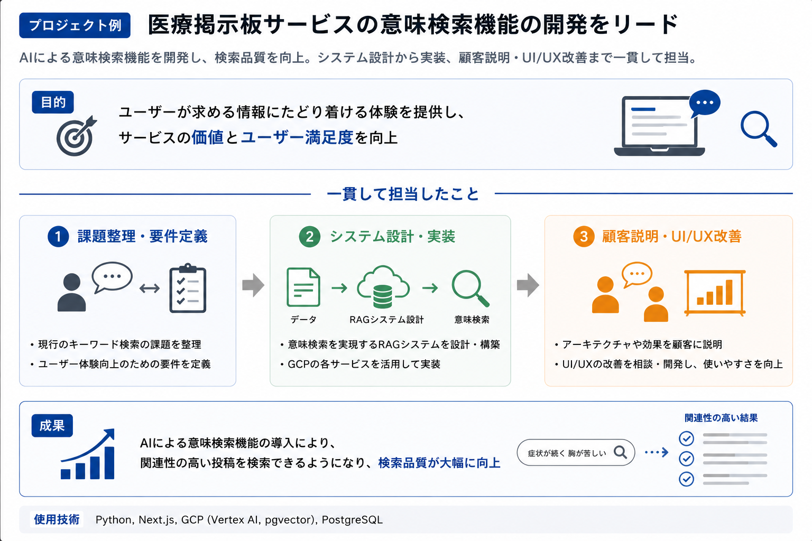
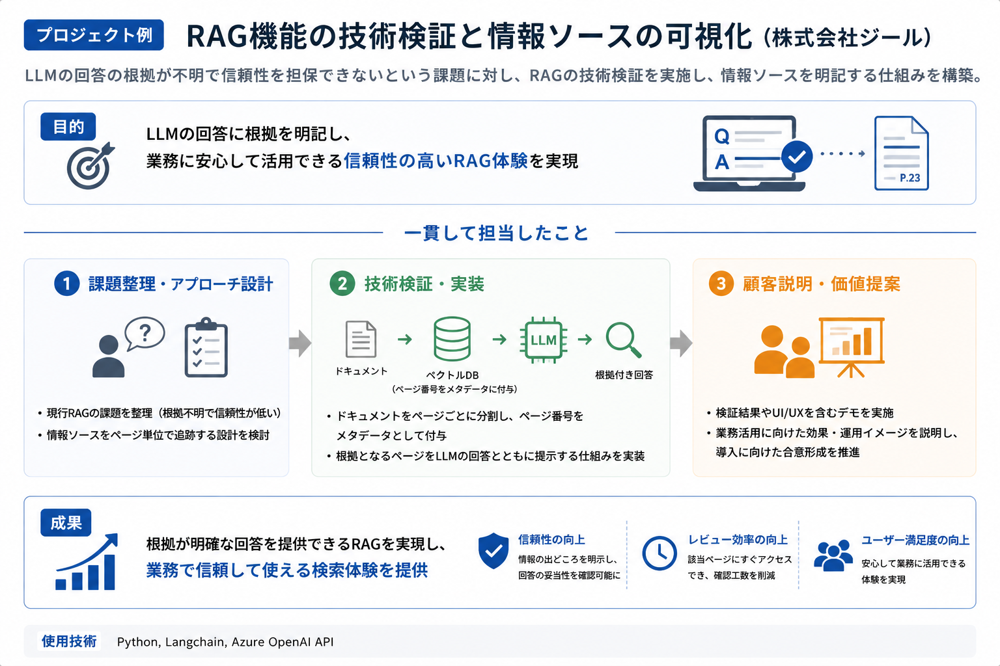
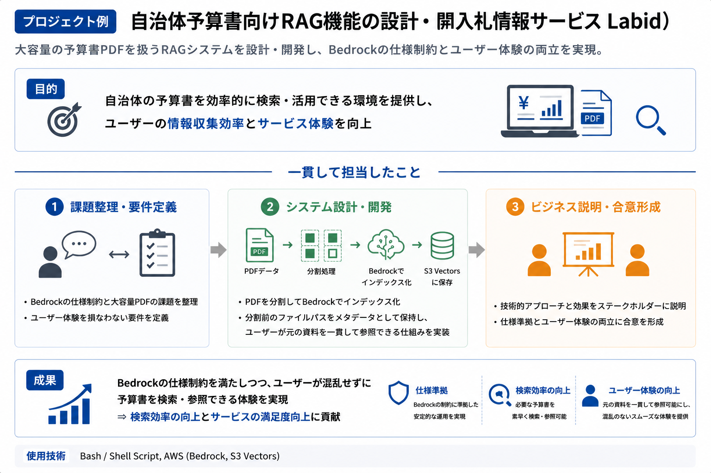
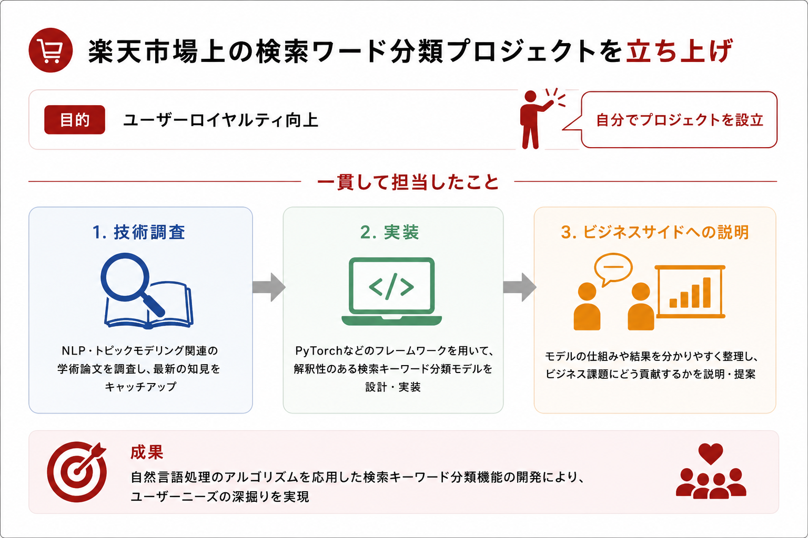

  

    <h1 style="font-size: 22px; border-bottom: 2px solid #333; padding-bottom: 6px; margin: 0 0 8px 0;">栗林雷旗</h1>
    
<a href="snq7amf522dvzpjbwshb@gmail.com" style="color: #0066cc; text-decoration: none;">Email</a> | <a href="https://www.linkedin.com/in/raiki-k/" style="color: #0066cc; text-decoration: none;">Linkedin</a>

  

  

## 職歴

### Oct 2025 - Present
**合同会社TinyInventor - 代表社員**  

**会社紹介**
合同会社TinyInventorは「AIを使いたいが、どこから始めればいいかわからない」という企業の課題を解決するAIエンジニアリング会社です。RAGによる情報検索を通じてコミュニケーションを活性化するサービスの実装など、クライアントの業務に合わせた実装を提供します。大手IT企業・スタートアップ双方での開発経験を持つエンジニアが、技術とビジネスの両面から伴走します。

取引先企業:  [Techtical](https://www.techtical.co.jp/), [アクティブコア](https://www.activecore.co.jp/)

プロジェクト1: Forward Deployed Engineerとして大手化粧品会社におけるマーケティング業務のBPaaSに参画。クライアントがメルマガコンテンツの制作を自動化してより多くの施策を行いたいという課題に対し、プロダクトを顧客のコンテンツ要件に合わせて実装。顧客説明においては目指すべきコンテンツの品質に関する認識のすり合わせ、および現状とのギャップの整理を実施し、クライアントに納得感をもってプロジェクトに協力してもらえるよう対応。  
使用技術: Typescript, Mastra

プロジェクト2: AIエンジニアとして医療掲示板サービスの開発をリード。現行サービスではユーザーが入力したキーワードに部分一致する投稿しか検索できなかったが、AIによる意味検索機能を開発することで検索品質を向上。GCP上でのRAGシステム開発およびアーキテクチャ図の制作・顧客説明を担当。UI/UXの改善についてクライアントと相談・開発を実施。  
使用技術：  Python, Next.js, GCP(Vertex AI, pgvector), PostgreSQL

 

### Oct 2025 - Apr 2026
**[株式会社ジール](https://www.zdh.co.jp/) - AIエンジニア** 使用技術：Python, Langchain, Azure OpenAI API

OpenAIのAPIを組み込んだRAG機能の技術検証を担当。ユーザがLLMからの回答を受け取った際に情報の根拠が明記されておらず正しい情報か確認できないため、実際の業務に活用できないという課題があった。そこでソースとなるドキュメントをページごとに分割してページ番号をメタデータとして使用するアプローチをとり、**LLMのアウトプットをユーザーがレビューできる仕組みを実現**。

### Dec 2025 -Jan 2026
**[Nehan株式会社](https://nehan6.com/) - AIエンジニア** 使用技術：Bash / Shell Script, AWS(Bedrock, S3 Vectors)

[AI入札情報サービスLabid](https://labid.jp/) に自治体の予算書ドキュメントをインプットしたRAG機能の設計開発を担当。Amazon S3 Vectors に保存したPDFデータを Bedrock でインデックス化する際に、一部予算書のデータが大容量のため Bedrock の仕様に違反する問題に対応。ソースファイルが分割されているとユーザの混乱を招き体験の質を損なったしまうため、Bedrock にドキュメントを渡す際にファイル分割はしつつも分割前のファイルパスをメタデータとしてもたせるアプローチを行うことで Bedrock 仕様への準拠とユーザー体験の質を両立。

### July 2024 - Sep 2025
**楽天グループ株式会社 - データサイエンティスト** 使用技術：Python, Pandas, BigQuery

**ユーザーロイヤルティ向上を目的とした「楽天市場上の検索ワード分類プロジェクト」を設立。**
学術論文 (NLP、トピックモデリング関連) から技術情報をインプットし、解釈性のある分類モデルの構築に向けPyTorchなどのフレームワークを用いて数理的理論の実装。技術ソースからビジネスサイドが求める情報を抽出して伝える技術とビジネスの橋渡し役としての振る舞いを心がける。自然言語処理のアルゴリズムを応用した検索キーワード分類機能の開発によるユーザーニーズの深掘りを実現。

