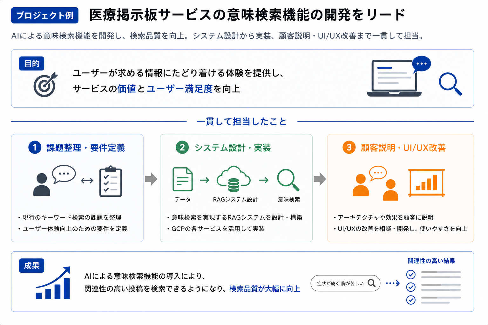

  

    <h1 style="font-size: 22px; border-bottom: 2px solid #333; padding-bottom: 6px; margin: 0 0 8px 0;">栗林雷旗</h1>
    
<a href="snq7amf522dvzpjbwshb@gmail.com" style="color: #0066cc; text-decoration: none;">Email</a> | <a href="https://www.linkedin.com/in/raiki-k/" style="color: #0066cc; text-decoration: none;">Linkedin</a>

  

  

2026年9月12日現在

## キャリアビジョン

機械学習エンジニアとして確実に利益を生める人材でいたい

技術は思い入れではなく、事業の利益とユーザーの意思決定への貢献度でフラットに選びます。

その中で一貫して取り組んできたのが、AI・機械学習の出力を「それらしい結果」で終わらせず、人が根拠を確認して意思決定に使える状態まで設計しきることです。

検索クエリ分類ではビジネス側が判断できる形にPros/Consを翻訳し、RAG開発では回答の根拠となるページ・元文書まで辿れる設計を実装してきました。

今後はこの軸を主戦場として、AI機能をプロダクトの利益に変える開発を深めていきます。

---

## 1. 楽天市場検索クエリ分類によるニーズ解析プロジェクト

- 参加した年/期間: 2025年 / 1年以内
- プロジェクトの種類: webサービス
- 担当工程: 企画, 要件定義, 設計, コーディング, データ分析
- 職種・役割: 機械学習エンジニア, データ分析
- 使用技術: Python, 自然言語処理

### 詳細

楽天でユーザー体験向上を目的とした楽天市場の検索クエリ分類プロジェクトを立ち上げ, 技術選定, 実装まで担当。フロントに立ってビジネスサイドの部署とコミュニケーションをとりながら進めました。

元々は特定商品に辿り着いたユーザーが検索していたクエリの集計のみ行う業務でしたが、ビジネスサイドの担当者が手作業で分類を行ってトレンド把握に努めていたことから、自然言語処理により自動化できるのではないかと考えました。

技術選定は論文を探して仕組みを理解し、本プロジェクトで必要となるタスクに沿うようPros/Consを精査してビジネスサイドに噛み砕いて説明を行いました。技術とビジネスの間を横断して価値を生み出す役割を担えたと考えています。

---

## 2. ドキュメント検索を目的としたRAGアプリケーション開発

- 参加した年/期間: 2025年 / 3ヶ月以内
- プロジェクトの種類: webサービス
- 担当工程: 要件定義, 設計, コーディング
- 職種・役割: 機械学習エンジニア
- 使用技術: shell script, AWS

### 詳細

AWS Bedrock Knowledge Base を用いた RAG アプリケーションの設計・開発を行いました。

地方自治体の予算書・総合計画などの大容量 PDF (50MB 超) を対象に、Bedrock のファイルサイズ制限を回避しつつ、検索精度とユーザー体験を両立させることを目的としています。

具体的には、元 PDF を S3 に保存した上で、ローカル環境にて PDF を分割し、検索用チャンクのみを Knowledge Base 用 S3 バケットへ同期する前処理パイプラインを Bash で実装しました。

各分割 PDF には .metadata.json を付与し、都道府県名・組織名・文書種別・年度に加え、分割前のオリジナル PDF の S3 URI をメタデータとして保持する設計としています。

このアプローチにより、RAG 検索結果から元ファイルを特定し、ユーザーには分割されていないオリジナル PDF を提供できる仕組みを実現しました。

このプロジェクトを通じて、インフラの仕様上の制約をクリアしながら、ユーザーに提供したい体験と両立させる経験を得ました。

---

## 3. RAG機能技術検証プロジェクト

- 参加した年/期間: 2025年 / 3ヶ月以内
- プロジェクトの種類: 業務システム
- 担当工程: 設計, コーディング
- 職種・役割: バックエンド, 機械学習エンジニア
- 使用技術: Python, LangChain, Azure OpenAI API, API, OpenAI, LLM, RAG

### 詳細

Azure OpenAI APIを組み込んだRAG機能の技術検証を担当しました。

課題としては、ユーザーがLLMアプリケーションからの回答を受け取った際に情報の根拠が明記されておらず正しい情報か確認できないため、実際の業務に活用できないという問題がありました。

そこでソースとなるドキュメントをページごとに分割し、ページ番号をメタデータとして付与するアプローチを採用しました。

回答の根拠となったページをユーザーが簡単に確認できるようにし、LLMのアウトプットをユーザーがレビューできる仕組みを実現しました。

---

## 4. 医療掲示板サービスのRAGシステム開発

- 参加した年/期間: 2026年 / 1年以内
- プロジェクトの種類: webサービス
- 担当工程: 要件定義, 設計, コーディング, テスト, 運用/保守
- 職種・役割: インフラ, 機械学習エンジニア
- 使用技術: Google Cloud Platform, pgvector, PostgreSQL, RAG, TypeScript, Next.js, Cloud Run, Cloud SQL, Docker

### 詳細

GCP上でのRAGシステム全体の設計・開発から、検証・本番環境の構築、運用設計、アーキテクチャ図の制作・顧客説明までを一貫して担当し、約4ヶ月半でスケジュール通りに納品、クライアント検収を完了しました。

クライアントが運営する医療掲示板はキーワード検索のみで、テキストが一致しない情報を取得できない課題がありました。既存サービスにAI検索を組み込み、意味検索による検索体験の向上を実現しました。

pgvectorによるベクトル検索とGemini APIによる埋め込み生成・回答生成のRAGパイプラインを構築（当初Vertex AI構成から、費用管理の適正化のためAPIキー方式へ移行判断）。加えて、投稿の新規・編集・削除に自動追従するデータ更新パイプライン（日次差分＋週次照合、冪等設計）、ユーザー別・サイト全体の利用回数制限（環境変数のみで非エンジニアが運用可能な設計）、フィーチャーフラグによるダークローンチ（本番反映とユーザー公開の分離）を実装しました。

納品にあたってはGCP環境のセキュリティレビューを実施し、ファイアウォール規則・サービスアカウント鍵・検証時代の残置リソースなど13項目を実機確認のうえ棚卸しし、対応計画として提示。検証環境の運用コスト試算まで含め、クライアント自身が設定変更だけで運用を継続できる体制設計を行いました。

週次でユーザー体験のディスカッションと開発のサイクルを回し、要件を実装するだけの開発者ではなく、技術を通じてクライアントの意思決定を助ける伴走者として活動しました。

---

## 5. インターンシップマッチングサービスのバックエンドAPI開発

- 参加した年/期間: 2026年 / 3ヶ月以内
- プロジェクトの種類: webサービス, 自社プロダクト
- 担当工程: 設計, コーディング, テスト
- 職種・役割: バックエンド
- 使用技術: Python, FastAPI, PostgreSQL, SQLAlchemy, Docker

### 詳細

学生・学校・企業の3ロールが利用するインターンシップマッチングサービス(自社開発)のバックエンドを前任者から引き継ぎ、BE専任1名体制で担当しました。約1ヶ月の担当期間で、機能開発6本・技術的負債解消1本のPRを設計・実装・テスト・レビュー対応まで単独で完遂しています。

Clean Architectureの4層構成とPostgreSQLのRow Level Securityを軸とする既存設計に沿って、パスワード再設定機能(トークンをハッシュ化してDB保存、原子的なUPDATEによる二重使用防止、メールアドレス列挙攻撃対策)、イベント参加申込機能(DBのUNIQUE制約を真実の源とする重複防止、操作×ロールのマトリクスでのRLSポリシー設計)、メール送信・画像アップロード基盤(抽象インターフェースを切り、将来のSendGrid/S3移行を実装差し替えのみに限定する設計)を実装しました。

また、フロントエンドとのレスポンスキー規約の不整合(snake_case/camelCase)を解消するため、Pydanticの基底クラス設計で17ルータ・42スキーマを一括移行しました。リクエストは両形式を受け付ける互換レイヤーを設けて後方互換を維持し、BFF層への破壊的影響を事前調査した上でフロントエンド担当と同期マージを調整し、稼働中の機能を止めずにリリースしています。

品質面では、mypy strictの残存エラーを全ファイルで解消して型安全性の基準線を確立し、単体180件・統合292件のテストをCIグリーンの状態で維持しました。退任時には、コードから読み取れない設計判断の経緯や保留中の課題を引き継ぎ資料として整備しています。

短期間の担当でしたが、API契約・セキュリティ・型・テストといったwebバックエンド開発の基本を実務水準で一巡させ、機械学習案件で培った「制約の中で体験を成立させる設計」がwebアプリケーション開発でも通用することを確認できたプロジェクトです。

---

## 6. テレビ視聴データを用いたクロスメディア広告効果測定のデータサイエンス業務

- 参加した年/期間: 2026年 / 3ヶ月以内
- プロジェクトの種類: webサービス, 自社プロダクト
- 担当工程: コーディング, テスト, データ分析, コードレビュー, 技術ドキュメント作成
- 職種・役割: 機械学習エンジニア, データ分析, アルゴリズムレビュワー
- 使用技術: Python, pandas, polars, NumPy, SciPy, Plotly, SQL, BigQuery, Google Cloud Platform, Cloud Run, Cloud Run Jobs, Docker, Git, Jupyter, uv, Claude Code

### 詳細

【プロジェクト概要】
テレビ視聴率調査会社のデータサイエンス部門にデータサイエンティストとして参画。TV視聴ログ(パネル実測)とデジタル広告データ(集計値のみ)を統合してリーチ・フリークエンシー分布・事業インパクトを推定するクロスメディア広告効果測定アルゴリズムの検証・形式知化、社内シミュレータ・分析アプリのアルゴリズムレビュー、広告主・広告代理店向けのアドホック視聴分析を担当しています。
使用技術: Python(pandas / polars / NumPy / SciPy / Plotly)、BigQuery、GCP(Cloud Run / Cloud Run Jobs)、Git、Claude Code

【取り組んだ課題】
中核のリーチ推定アルゴリズム(負の二項分布・ガンマ/ポアソン混合モデルベース、6ステップのパイプライン)が属人化しており、開発者以外がモデルの仕組みを説明・実行できない状態でした。また、開発者がコードを書きレビュワーが不在という体制で、社内の出稿シミュレータや分析アプリの妥当性を第三者が検証する仕組みがありませんでした。
コードと理論の突き合わせでモデル全体(実測値からのパラメータ数値求解 → ガンマ分布による個人への分解 → ポアソン過程での集計 → モンテカルロ法による事業インパクト推定)を独力で再構成し、BigQueryからのデータ取得から最終集計まで全ステップの実行検証で再現性を確認。モデルの仮定と限界を明記した解説・実行手順・案件対応用パラメータ早見表からなる技術ドキュメントを執筆し、アルゴリズム開発者のレビューを経て部内公開しました。あわせて製品UI(メディアプランナー)の操作と各入力項目・出力指標をパイプラインの変数に対応付け、UI上の「重複」など粒度の異なる同名指標の区別を整理しました。
リテールメディア出稿シミュレータ(Cloud Run + Cloud Run Jobsで稼働する予算配分最適化アプリ)のアルゴリズムレビューでは、「旧実装との数値一致(等価性)はモデル仮定の妥当性を保証しない」という観点を立て、多本数出稿時のリーチカーブ外挿仮定やキャリブレーションの適用範囲といった、検証が及んでいなかった前提を顕在化させました。2回目のレビューではアプリをローカルで実走させて全探索最適化を完走させ、総額不変・ランキング整合・ベン図内訳・タブ表示条件を確認。さらに製品SaaS側でリーチ分析を8エリア分作成し、人口加重平均GRPとエリア合計リーチ人数をアプリ出力と突合する整合性検証をクライアントリリース前の期限内に完了しました。
番組視聴ヒートマップ分析アプリのレビューでは、リーチ突合による自己検証機構・接触者の再ラベリング・ターゲット視聴率と含有率の二指標といった処理の流れを言語化した理解ドキュメントを作成。Excel経由でCSVの24時以降時刻が秒付きに変形して起きた本番障害の修正コミットについては、Excelの実挙動を手元で一次再現し、コミットから修正前後の関数を抽出して同一入力で比較する検証を行い、障害再現・修正確認・リグレッションなしを同日中に報告しました。
通信キャリアからのGRP定義の問い合わせに対しては、視聴率用・GRP用・リーチ用で異なる有効パネル定義や、エリア人口を分母とする延べ視聴率・15秒換算の実装をコードから特定し、回答の根拠を提示しました。

【取り組みの成果】
属人化していたアルゴリズム知識を「読めば実行できる」形式知へ変換し、部内の誰でもアドホック案件へ対応できる状態を実現。検証過程では共有モジュールの潜在バグ(例外処理の誤り・数値スケール計算の混入)、READMEに未記載の実行モード環境変数、docstringの用語不整合を発見・報告しました。
出稿シミュレータの整合性検証では、8エリア合計リーチ人数と人口加重平均GRPがアプリ出力と完全一致することを確認してクライアントリリースを後押しし、突合時に必要な15秒換算・リアルタイム視聴の選択といった手順を再利用可能な検証手順として残しました。部門初のアルゴリズムレビュワーとしてレビュー文化の立ち上げに関わり、「対象→目的→処理の流れと考察→質問」というレビュー記録の型を定着させています。
あわせてウェイトバック(層別補正)・リーチカーブ・有効パネルの使い分け・15秒換算・按分視聴率と1/3ルール視聴率の区別といった視聴率調査ドメインの計量手法を実務水準で習得しています。

---

## 7. 大手製薬会社 ファンイベント公式Webアプリの開発

- 参加した年/期間: 2026年 / 3ヶ月以内
- プロジェクトの種類: webサービス, 受託開発
- 担当工程: 要件定義, 設計, コーディング, テスト
- 職種・役割: バックエンド, インフラ, DevOpsエンジニア
- 使用技術: AWS, TypeScript, Next.js, Prisma, PostgreSQL, Docker, GitHub Actions

### 詳細

【プロジェクト概要】
大手製薬会社が開催するファンイベントの公式Webアプリ(会員認証・入場QR・混雑状況表示・お知らせ配信)を、制作会社経由の受託で開発しています。PM・フロントエンド担当・私(インフラ/バックエンド)の少人数体制で、見積もり・技術選定の段階から参画し、インフラとバックエンドおよび技術基盤全般を担当しています。

【取り組んだ課題】
イベント当日に確実に稼働することが至上命題のシステムです。AWS上にVPC・ALB・ECS Fargate・RDS(PostgreSQL)・S3・CloudFrontの本番構成を設計・構築し、GitHub ActionsによるCI/CD(テスト・Lint、DockerビルドとECRプッシュ、develop/main環境分岐のECS自動デプロイ)を整備。認証はOIDC、シークレットはSSMパラメータストアで管理し、初回デプロイがIAMのpermissions boundary起因で失敗した際は、認証・権限・境界ポリシーの3層を切り分けて解決しました。
アプリケーション側では、PrismaによるDBスキーマ設計、JWT認証の設計(発行・ミドルウェア検証・ブルートフォース対策のアカウントロック)、APIエンドポイント一覧と型定義の整備を担当し、API仕様テンプレートを起点にフロントエンド担当との合意プロセスを整えた上で、認証・混雑状況・お知らせの各APIを実装しています。

【取り組みの成果】
インフラ・CI/CD・DB/API設計のすべてをPMのPRレビューを経てマージ済み。認証・混雑状況・お知らせの各API(計9本)の実装を完遂してレビューに乗せ、現在はフロントエンドとの結合フェーズに入っています。9月末の本番リリース、10月のイベント当日稼働に向けて進行中です。

---

## 8. 人材紹介企業向け 求人票チェックAIシステムの要件定義・設計

- 参加した年/期間: 2026年 / 3ヶ月以内
- プロジェクトの種類: 業務システム, 受託開発
- 担当工程: 要件定義, 設計
- 職種・役割: 機械学習エンジニア, インフラ
- 使用技術: AWS, Amazon Bedrock, LLM, 生成AI

### 詳細

【プロジェクト概要】
広告・マスコミ領域専門の人材紹介企業向けに、求人票の品質チェックを生成AIで支援するシステムの要件定義・基本設計を担当しています。求人票の必須項目チェックと文章品質チェックをLLMで自動化し、既存の求人管理システムへの入力前に人手で行われているチェック業務を置き換えることを目指すプロジェクトです。

【取り組んだ課題】
週次の顧客定例と終日の現地訪問を通じて業務フローをヒアリングし、「チェック結果を誰がどこで修正するか」といった運用設計まで含めて要件を整理しています。技術面では、既存求人システムとの接続方式を複数案(IP許可リスト・VPN・踏み台)で比較設計し、ネットワーク要件を顧客側インフラ担当と直接協議。Amazon Bedrockの利用コストを処理件数ベースで試算し、月次運用費として顧客に提示・合意形成を行いました。画面設計レビューや、既存環境で稼働中のチェックプロンプトの移植可否評価など、スコープと見積もりの調整にも技術側から参加しています。

【取り組みの成果】
要件定義フェーズを完了し、基本設計・見積もり確定に向けて進行中です。生成AIの回答品質だけでなく、コスト・ネットワーク・運用フローまで含めて「業務で使い続けられるAIシステム」の成立条件を顧客と一緒に設計する経験を積んでいます。
